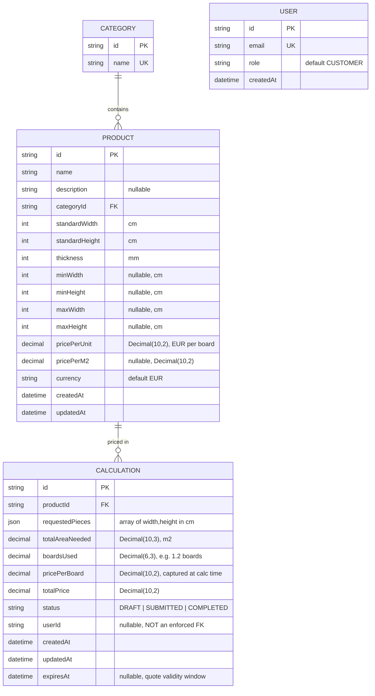

# Database Schema (ERD)

Generated from the real `backend/prisma/schema.prisma` — 4 models: `Category`, `Product`, `Calculation`, `User`.

## Notes

- **`Calculation.userId` is not a real relation.** There's no `@relation` between `Calculation` and `User` in the schema — `User` exists as scaffolding for a future auth phase, and `userId` is whatever value the client sends, unverified. This is deliberate (see Known Limitations in the root `README.md`), not a missing foreign key that should be added.
- **Indexes:** `Product.categoryId`; `Calculation.userId`, `Calculation.status`, `Calculation.createdAt`.
- **`onDelete: Restrict`** on `Product → Category` and `Calculation → Product` — you can't delete a category or product that still has dependent rows.
- All monetary fields use `Decimal`, not `Float` — see `docs/DECISIONS.md` for why (float rounding is unacceptable for pricing).

For how these fields map to Agloval's eventual real-database column names, see `docs/MIGRATION_GUIDE.md` — that mapping lives in `// MIGRATION:` comments in the schema itself and in the persistence-layer mappers, not as Prisma `@map` directives (see `docs/ARCHITECTURE.md` for why the mapping boundary sits there).
